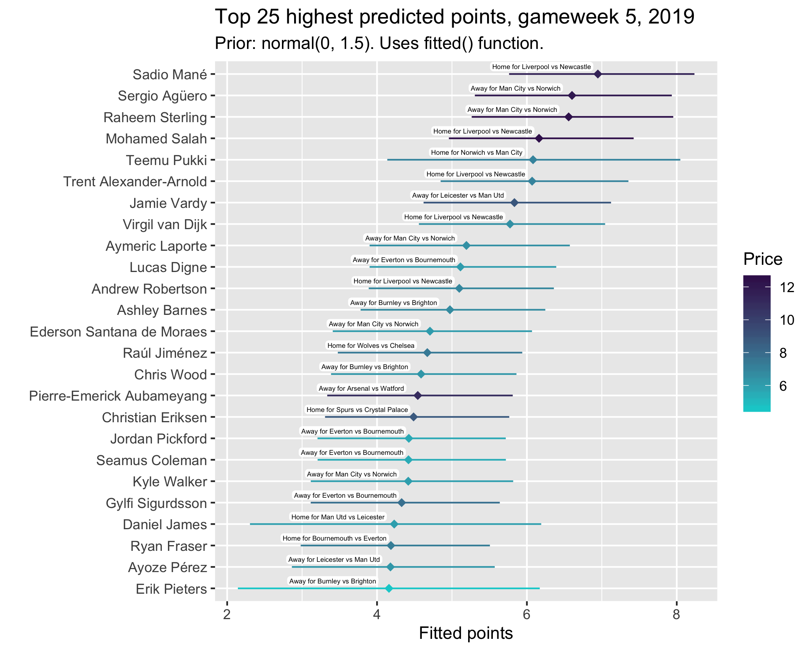
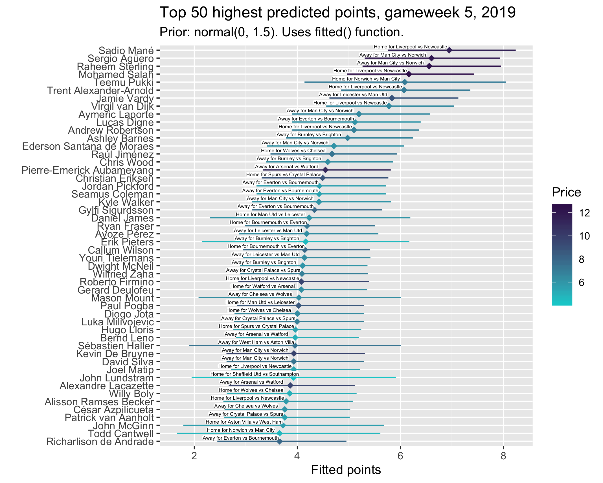
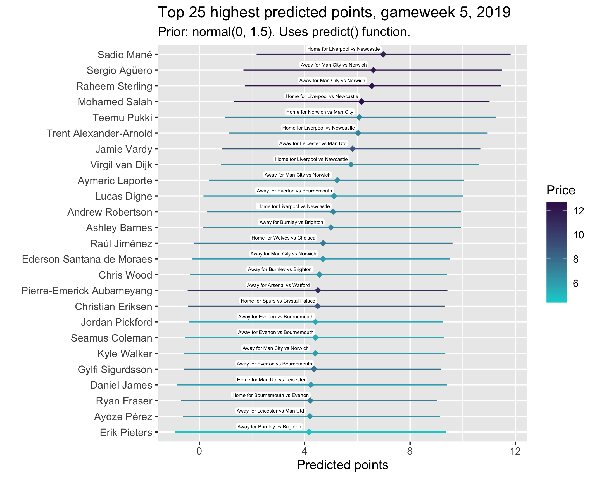
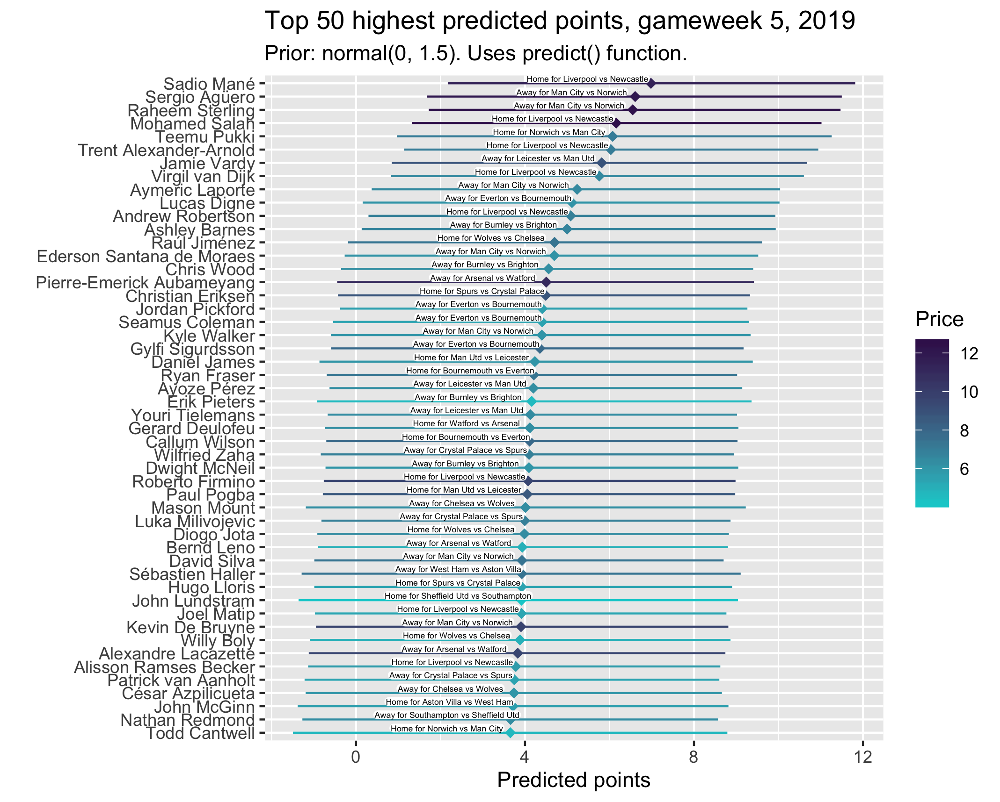

## Picking an FPL captain: Gameweek 4

Two weeks ago I wrote a post about picking a Fantasy Football captain for gameweek 4, based on a Bayesian multilevel model of player points and its predictions for the upcoming matches. The post got a fair amount of attention from Reddit and it quickly became apparent to me that I was going to need to revise my model, because it was pretty crap. I have since put a lot of work into improving the model, sorting out more data (from [vaastav's github]((https://github.com/vaastav/Fantasy-Premier-League))) and hopefully getting more meaningful estimates. The ggplots are prettier now too. All code is on [my github](https://github.com/mbarnfield/fpl) and should now be a bit clearer and cleaner.

## Last gameweek

If you had gone with the top projected points scorer from my previous model as your captain, Teemu Pukki would've got you a disappointing 4 points. I did include lots of caveats about this in my posts though, and thought it was probably a bit silly to go with Pukki, who was clearly overperforming in the first few weeks of the season. Most of the other top picks would have served you quite well, although Sterling unfortunately didn't haul. However, like I said, that model was pretty dodgy, so I don't really want to dwell on its predictions. It was more of a concept I was testing out, on which I have now improved. I hope no-one put too much stock in it. It also *still needs work* and I'm always improving the model.

## Changes to the model

The key changes to the model are the priors, the formula, and the data. Previously I said I was using weakly informative priors, but had mistakenly not applied these in the model syntax (*rolls eyes* I know) so the beta parameters (mostly, player coefficients) had uniform priors, meaning they essentially listened only to the data. This gave some very questionable point estimates and confidence intervals, with for example 95% of Pukki's probability over 10, as one Reddit user pointed out. I did keep saying that they weren't meant as absolute points predictions, but more as relative player comparisons, but I know they still didn't really hold water. I have tightened up the priors now, and throughout the past couple of weeks have tried a few different things to see how the results change (back to that in a second). I settled on keeping the model family gaussian, and having normal priors for the beta parameters, with student_t on all other coefficients. I also applied specific priors to Norwich, Sheffield and Aston Villa as opponents (normal(1, 5)), to account loosely for the fact that the model doesn't know they are promoted teams against which players would be expected to get more points.    

The formula mow includes a spline for gameweek, in an attempt to account for the fact that there is variance over time in players' performance. I don't think this quite does the job I want it to though, so will consider swapping this out for, or also adding in, weightings in the next version.   

The most major change, though, is the data. Whereas before I was only using this season's data, the model is now run on data from February onwards. I chose not to use all of last season's data because of the January transfer window which complicates things a bit. With this extra data, players who featured last season have more meaningful estimates that factor in their historical performance as well as their early season form. I need to turn this into a multi-membership model really, to account for the fact that some players played for one team last season and another now (e.g. Iwobi, moving from Arsenal to Everton). Again, I'll look to do this next time.

## New players' sensitivity to priors

Because of this extra data, the predictions of players who featured last season are pretty robust to my choice of priors. No matter what beta prior I set, the model tells me that Agüero, for example, is likely to score well. This isn't so much the case for players who *didn't* feature last year, though. To demonstrate this, look at the plots below. These are the top 25 predicted point scorers for gameweek 5, changing the prior from normal(0, 1.5) to normal(0, 2.5), normal(0, 10) and then normal(0, 50). Just changing the variance in the prior is enough to have a substantial impact on the points predictions of players with minimal data because it sort of alters the extent to which the model listens to the data. In the case of normal(0, 1.5), I've told the model that I'm very sure each parameter only effects points by an amount pretty close to zero. When players have lots of observations, they will overcome this prior and their true performance will start to dominate their prediction. But, for players like Pukki, this has a considerable effect. He goes from being the clear favourite in normal(0, 50) to a very uncertain member of the top five in normal(0, 1.5). Players like Mount and Haller don't even appear in the top 25 until the priors are widened. Note that these plots are generated with code using the "meanfield" algorithm, whose estimates can be very unstable, so these shouldn't be over-interpreted. 

 

 

 

 

 

## Choosing the prior

This, of course, presents a bit of a problem. I need to choose one of these priors, which equates to deciding how skeptical I want to be of new players' performance. Personally, I'm not overly concerned about the idea of including quite restrictive priors in the model, but I know that might not sit right with some people. I think the conservatism this offers, though, is more valuable than 'letting the data speak' when the data itself is so minimal. We have some real knowledge about these players, so let's use it. Do you have more confidence in Aubameyang picking up some points against Watford, or in Canwtwell getting some against City? The too-wide priors back Cantwell here, because they are learning almost entirely from his performance this season. Admittedly, his credible interval is wide and the model is surer that Aubameyang will get a score near his prediction, but I would rather the model favour players for whom it has more data. So for the time being I am going with a normal(0, 1.5) prior on the beta coefficients. I will probably change this in a few weeks, when we have more data to go on.    

It's worth noting that the general composition of the top 25, and certainly the top 10, is similar regardless of the priors. It's mainly just the new players who move around. **Importantly these are players I think few good FPL players would have considered captaining anyway.** Who's really considering captaining Pukki against Man City? No-one. Mané against Newcastle, or Agüero against Norwich, are a different story. I'm just telling the model that it needs a good reason to shift a player's effect further away from 0, because prior to seeing any data each player's parameter is distributed with a 1.5 standard deviation around 0. This still implies that the parameters of ~95% of players will fall within the (-3, 3)ish range, and players with extra data easily escape these bounds if they should. Note that here I'm referring to the coefficients, and not the fitted points predictions.   

The key point here is that this isn't pernicious --- I'm just using knowledge to enhance the model through more meaningful priors. This is also in keeping with the spirit of the model. As I discussed in my first post, the whole point of this is to represent the captain-picking logic most players go through. We consider our players' form, their overall class/quality, their opponent, whether they're home or away. All this model does is formalise this logic and compare players on the basis of their probabilities of scoring points, given the combination of these variables in the upcoming gameweek. Given that the whole thing is about modelling how we 'think' about captains, I think it's even more justifiable to use narrower priors that clearly support our knowledge about players. A prior that casts Pukki as the best captain pick, or highest points scorer, just doesn't do this. Pukki is great, and you might understandably back him to score against City, but giving the captaincy would be extremely high-risk. Even if you do think adding priors like this is dodgy, I've been transparent and included versions with other priors above, so don't @ me. 

Anyway, below are the top 25 and then the top 50 predicted points scorers for this week. The first two plots use the fitted() function, and the two smaller plots use predict(). I'm including both because of how different their intervals are. I prefer fitted() for the more variable credible intervals, but it's worth seeing the difference in predict(). I'm not 100% sure where the difference comes from, but I've seen a few things suggested: fitted() is on the outcome scale, whereas predict() isn't, or fitted() doesn't factor in the inherent error of 'prediction' where as predict() does. The predict() plots are basically more conservative when it comes to certainty of the estimates, but the variability in the intervals in fitted() gives a clearer idea of how our levels of confidence in each player's estimate should vary. In other words, I see it this way: predict() gives more realistic intervals overall (in absolute terms), but fitted() gives a better idea of how our confidence might vary (in relative terms) across different players. The labels now include the venue, team and opponent rather than just the opponent, and I have attempted to make the price colour scale match the PL colour scheme.    

 

 
 

 

 

It looks like Mané is seen as the best option this week, closely followed by Agüero, Sterling and Salah. This is unsuprising given their fixtures. What might be surprising is Mané being ahead of Salah. I see a couple of potential reasons for this. One is that I have used data from the second half of last season in which Salah had a considerable points drought. Another is that Mané outperformed Salah in the last gameweek (4). 

So, you might be wondering whether to go for example for Agüero over Salah, because both have good fixtures and a high ceiling, and are reliable points scorers. The model suggests you should go for Agüero, on balance. Likewise, if it's between Mané and Sterling, it says you should go for Mané. Again, like I kept saying last week, this is the point:    

*If you're weighing up between a few different captaincy picks, this plot gives you an idea of which to pick based on their __probabilities__ of scoring given points totals.*    

Remember, though, this doesn't factor in *how many people* are captaining these players, which is a very relevant consideration. Nonetheless, I'll be captaining Sterling, because he's the highest ranked player I own.

